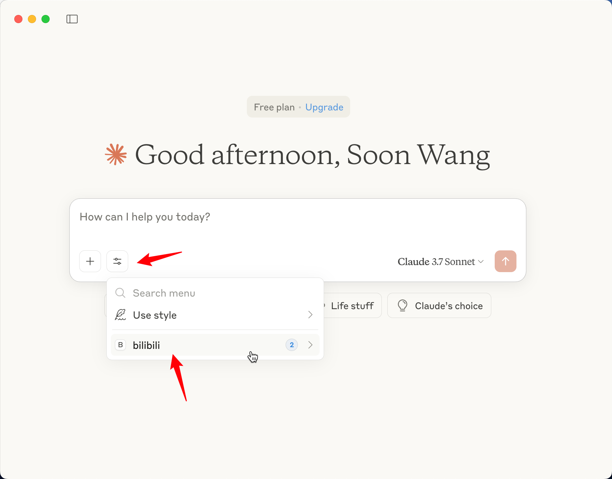
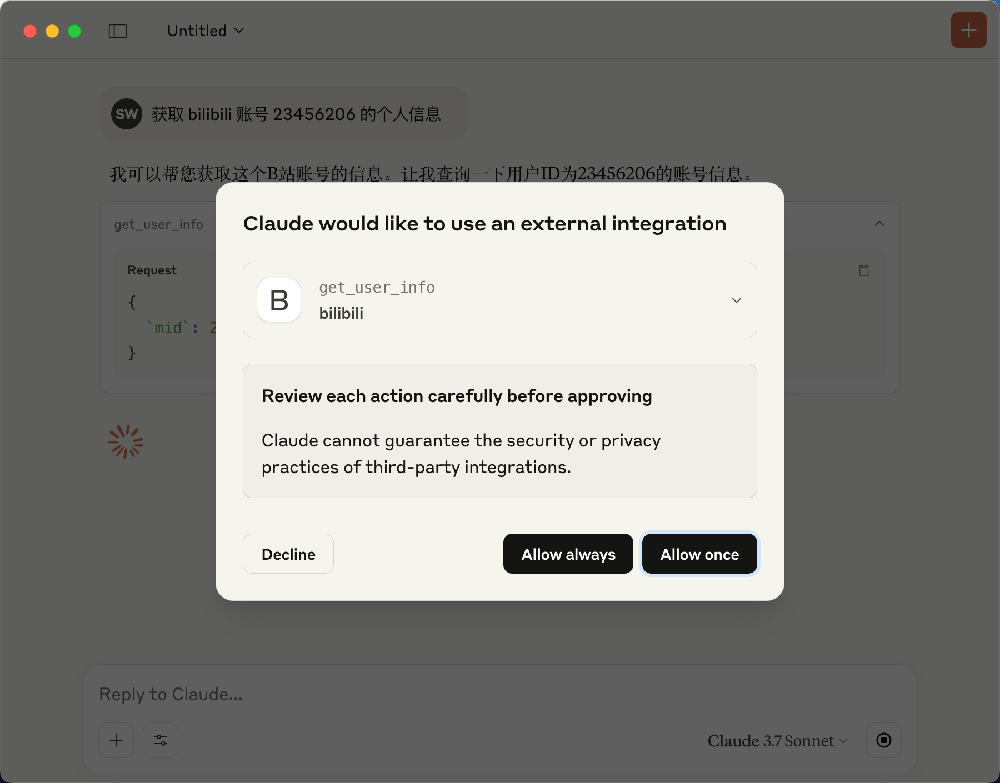

# bilibili MCP Server

> _Model Context Protocol ([MCP](https://modelcontextprotocol.io/introduction)) Server for [bilibili.com](https://www.bilibili.com)._

## Demo

- [ ] TODO

## Features

### User Info

- [x] Get user information
- [ ] Search videos

## Usage

### Claude Desktop

> Refer to the official [documentation](https://modelcontextprotocol.io/quickstart/server#testing-your-server-with-claude-for-desktop-2)

config for npm (recommended)

```json
{
    "mcpServers": {
        "bilibili": {
            "command": "npx",
            "args": ["-y", "@wangshunnn/bilibili-mcp-server"]
        }
    }
}
```

_**or**_

config for local cloned repo

```json
{
    "mcpServers": {
        "bilibili": {
            "command": "node",
            "args": [
                "/ABSOLUTE/PATH/TO/PARENT/FOLDER/bilibili-mcp-server/dist/index.js"
            ]
        }
    }
}
```

Save the configuration and restart. You will see the new Bilibili MCP option as shown below:

<div align="center">
  
  
</div>

## Local Development

1. Install dependencies

```sh
pnpm i
```

2. build

```sh
pnpm build
# or
pnpm dev
```

3. debug for local repo, see [above](#usage).

## Credits

- [bili-api](https://github.com/simon300000/bili-api)
