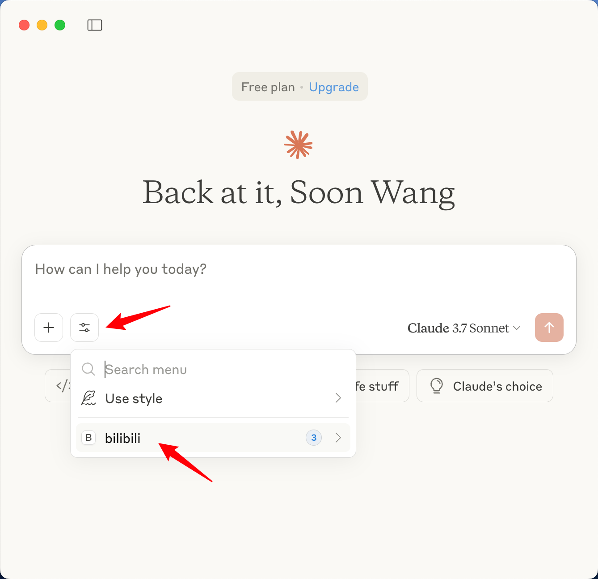
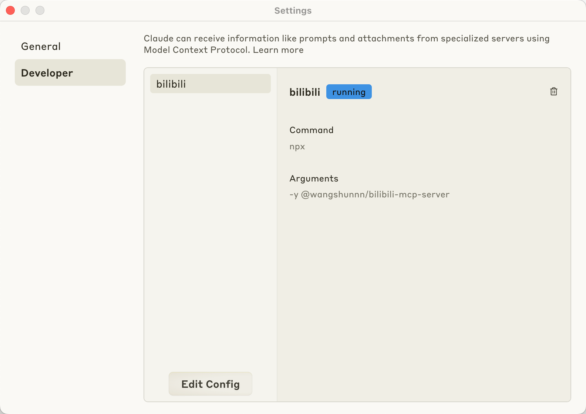

# bilibili MCP Server

A MCP server for Bilibili API integration

[![MIT licensed][badge-license]][url-license]
[![NPM version][badge-npm-version]][url-npm]
[][url-npm]

English | [简体中文](./README.zh-CN.md)

> _Model Context Protocol ([MCP](https://modelcontextprotocol.io/introduction))
> Server for the [bilibili.com](https://www.bilibili.com) API._

<a href="https://glama.ai/mcp/servers/@masx200/bilibili-mcp-server">
  
</a>

## Features

### User Info

- [x] Get user information by `mid`
- [x] Search video information by `bvid`
- [x] Search videos by keywords

## 使用方法

### Streamable HTTP 模式

bilibili-mcp-server支持两种运行模式：

1. **stdio模式**（默认）：通过标准输入输出与MCP客户端通信
2. **streamable-http模式**：通过HTTP协议提供MCP服务，支持SSE（Server-Sent
   Events）

#### Streamable HTTP 模式使用

要使用streamable-http模式，请使用以下命令启动服务器：

```bash
# 基本启动
node dist/streamable-http.js

# 指定端口
HTTP_API_PORT=8080 node dist/streamable-http.js

# 启用访问令牌认证
HTTP_API_TOKEN=your-secret-token HTTP_API_PORT=8080 node dist/streamable-http.js
```

服务器启动后，可以通过以下端点访问：

- MCP API端点：`http://localhost:PORT/mcp`
- 如果启用了令牌认证，客户端需要在请求头中添加：`Authorization: Bearer your-secret-token`

### 环境变量

- `HTTP_API_COOKIE`（可选）：设置此环境变量以提供您的Bilibili
  Cookie用于认证请求。这有助于避免因Bilibili的反机器人措施导致的"请求失败，封控检测问题"。示例格式：`SESSDATA=您的SESSDATA值; buvid3=您的buvid3值`
- `HTTP_API_TOKEN`（可选）：用于streamable-http模式的访问令牌认证。如果设置此环境变量，客户端请求时需要提供Bearer
  token进行身份验证。示例：`your-secret-token`
- `HTTP_API_PORT`（可选）：streamable-http服务器监听的端口号，默认为3000。示例：`8080`

cookie 可以在浏览器上获取。

注意：如果您使用的是 Chrome 浏览器，请确保已登录 Bilibili 账号。

### Claude Desktop

> Refer to the official
> [documentation](https://modelcontextprotocol.io/quickstart/server#testing-your-server-with-claude-for-desktop-2)

config for npm (recommended)

```json
{
  "mcpServers": {
    "bilibili": {
      "command": "npx",
      "args": ["-y", "@masx200/bilibili-mcp-server"],
      "env": {
        "HTTP_API_COOKIE": "您的SESSDATA值; buvid3=您的buvid3值"
      }
    }
  }
}
```

_**or**_

config for local cloned repo

```json
{
  "mcpServers": {
    "bilibili": {
      "command": "node",
      "args": [
        "/ABSOLUTE/PATH/TO/PARENT/FOLDER/bilibili-mcp-server/dist/index.js"
      ],
      "env": {
        "HTTP_API_COOKIE": "您的SESSDATA值; buvid3=您的buvid3值"
      }
    }
  }
}
```

Save the configuration and restart. You will see the new `bilibili MCP` option
as shown below:

<div align="center">
  



</div>

#### Demo Vedio

https://github.com/user-attachments/assets/813dece6-c9b5-4bc5-96c1-c3b4d284cc76

## Local Development

1. Install dependencies

```sh
pnpm i
```

2. build

```sh
pnpm build
# or
pnpm dev
```

3. debug for local repo, see [above](#usage).

## Publishing

To publish a new version to npm:

```sh
# For patch version update (0.0.x)
pnpm publish:patch

# For minor version update (0.x.0)
pnpm publish:minor

# For major version update (x.0.0)
pnpm publish:major
```

These commands will automatically:

1. Bump the version in package.json
2. Build the project
3. Publish to npm registry

## Credits

- [bilibili-API-collect](https://socialsisteryi.github.io/bilibili-API-collect/)

[badge-license]: https://img.shields.io/badge/license-MIT-blue.svg
[url-license]: https://github.com/masx200/bilibili-mcp-server/blob/main/LICENSE
[badge-npm-version]: https://img.shields.io/npm/v/@masx200/bilibili-mcp-server/latest?color=brightgreen
[url-npm]: https://www.npmjs.com/package/@masx200/bilibili-mcp-server
