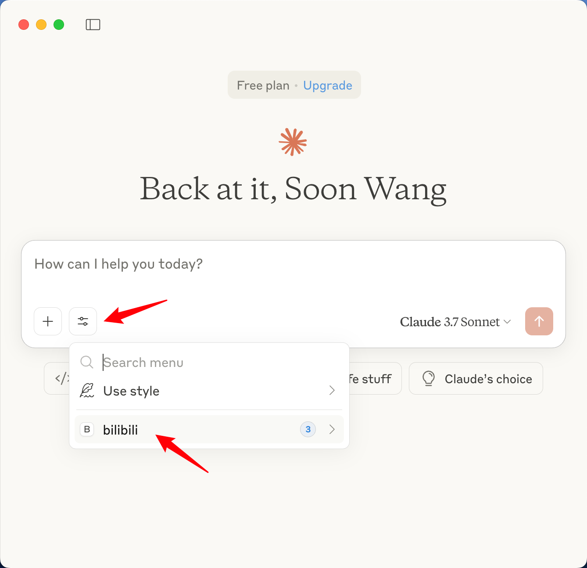
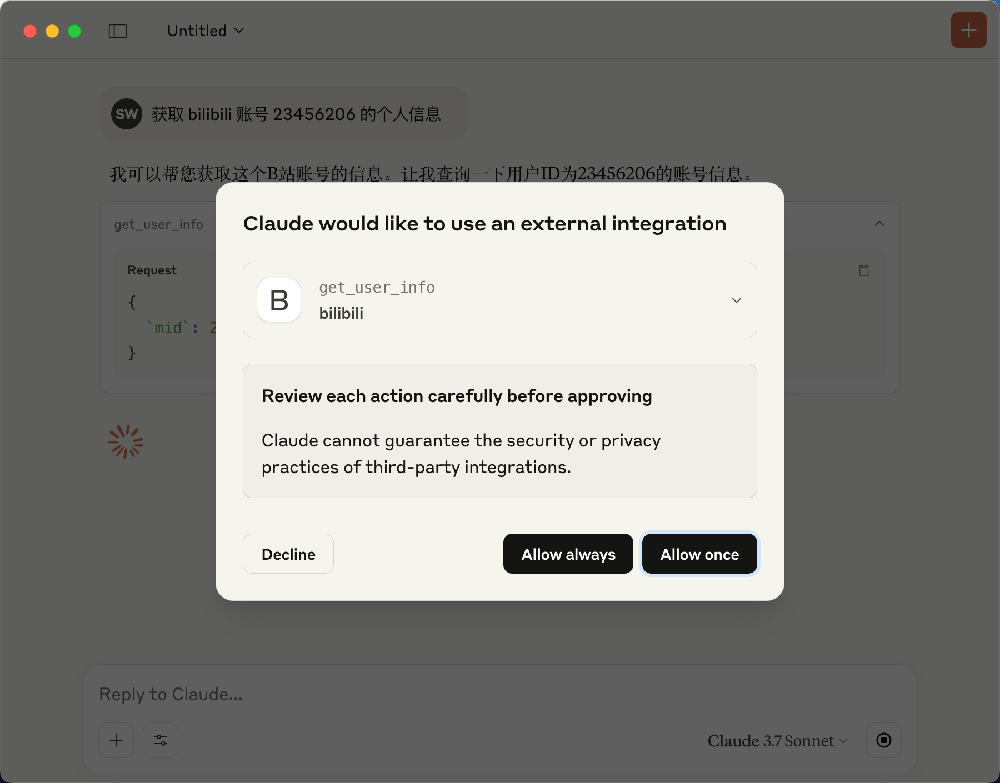
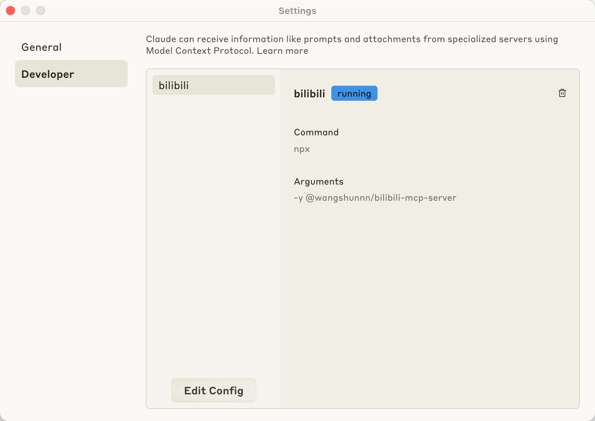

# bilibili MCP Server

[![MIT licensed][badge-license]][url-license]
[![NPM version][badge-npm-version]][url-npm]
[][url-npm]

[English](./README.md) | 简体中文

> _[bilibili.com](https://www.bilibili.com) 的模型上下文协议
> ([MCP](https://modelcontextprotocol.io/introduction)) 服务器。_

## 功能特性

### 用户信息

- [x] 通过 `mid` 获取用户信息
- [x] 通过 `bvid` 搜索视频信息
- [x] 通过关键词搜索视频

## 使用方法

### 环境变量

- `HTTP_API_COOKIE`（可选）：设置此环境变量以提供您的Bilibili
  Cookie用于认证请求。这有助于避免因Bilibili的反机器人措施导致的"请求失败，封控检测问题"。示例格式：`SESSDATA=您的SESSDATA值; buvid3=您的buvid3值`

cookie 可以在浏览器上获取。

注意：如果您使用的是 Chrome 浏览器，请确保已登录 Bilibili 账号。

### Claude Desktop

> 参考官方[文档](https://modelcontextprotocol.io/quickstart/server#testing-your-server-with-claude-for-desktop-2)

npm 配置（推荐）

```json
{
  "mcpServers": {
    "bilibili": {
      "command": "npx",
      "args": ["-y", "@masx200/bilibili-mcp-server"]
    }
  }
}
```

_**或者**_

本地克隆仓库配置

```json
{
  "mcpServers": {
    "bilibili": {
      "command": "node",
      "args": [
        "/ABSOLUTE/PATH/TO/PARENT/FOLDER/bilibili-mcp-server/dist/index.js"
      ]
    }
  }
}
```

保存配置并重启，您将会看到如下所示的新 `bilibili MCP` 选项：

<div align="center">
  




</div>

#### 演示视频

https://github.com/user-attachments/assets/813dece6-c9b5-4bc5-96c1-c3b4d284cc76

## 本地开发

1. 安装依赖

```sh
pnpm i
```

2. 构建

```sh
pnpm build
# 或者
pnpm dev
```

3. 本地仓库调试，见[上文](#使用方法)。

## 发布

发布新版本到 npm：

```sh
# 更新补丁版本 (0.0.x)
pnpm publish:patch

# 更新次要版本 (0.x.0)
pnpm publish:minor

# 更新主要版本 (x.0.0)
pnpm publish:major
```

这些命令将自动：

1. 更新 package.json 中的版本号
2. 构建项目
3. 发布到 npm 仓库

## 鸣谢

- [bilibili-API-collect](https://socialsisteryi.github.io/bilibili-API-collect/)

[badge-license]: https://img.shields.io/badge/license-MIT-blue.svg
[url-license]: https://github.com/masx200/bilibili-mcp-server/blob/main/LICENSE
[badge-npm-version]: https://img.shields.io/npm/v/@masx200/bilibili-mcp-server/latest?color=brightgreen
[url-npm]: https://www.npmjs.com/package/@masx200/bilibili-mcp-server
